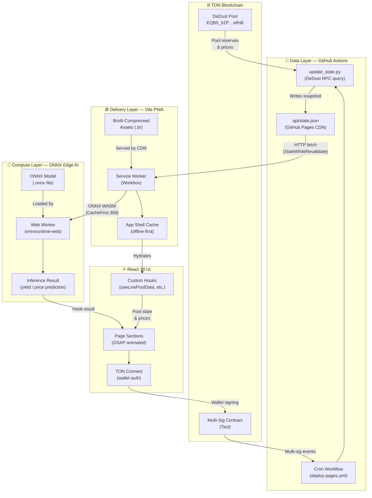

# SOLARIS CET — System Architecture

> **Zero-Cost Edge-Web3 Architecture** powering rural agricultural innovation in Puiești via the hyper-scarce CET token on the TON blockchain.

---

## Overview

SOLARIS CET is built on a four-layer architecture that eliminates traditional server infrastructure entirely. Every component runs either on free-tier managed services, the client device, or the TON blockchain — resulting in **zero recurring hosting costs** while delivering a production-grade, offline-capable Web3 experience.

---

## 1. Data Layer — GitHub Actions Cron API Offloader

**Purpose:** Eliminate direct browser-to-RPC calls by pre-fetching on-chain data via a scheduled GitHub Actions workflow, publishing a static JSON snapshot to GitHub Pages.

**How it works:**

- A `schedule` cron workflow (`.github/workflows/deploy-pages.yml`) runs on a timer.
- A Python script (`.github/scripts/update_state.py`) queries the **DeDust RPC** for the CET/TON pool state (`EQB5_hZPl4-EI1aWdLSd21c8T9PoKyZK2IJtrDFdPJIelfnB`).
- The extracted fields (`tvlTon`, `tvlUsd`, `priceUsd`, `tonPriceUsd`, and reserve amounts) are written to `app/public/api/state.json`.
- The static file is served from GitHub Pages CDN — no origin server required.

**Key properties:**

| Property | Value |
|---|---|
| Data source | DeDust REST API + TON RPC |
| Update frequency | GitHub Actions cron schedule |
| Delivery | Static JSON on GitHub Pages CDN |
| Client fallback | PWA Service Worker `StaleWhileRevalidate` (5 min TTL) |

---

## 2. Delivery Layer — Vite PWA + Brotli Offline-First

**Purpose:** Deliver the full application with sub-second load times to rural users on low-bandwidth connections, with complete offline functionality after first visit.

**Components:**

- **Vite 7** bundles the app into aggressively code-split ES modules (`manualChunks` by npm package).
- **`vite-plugin-compression2`** emits Brotli-compressed (`.br`) asset variants alongside every JS/CSS bundle — reducing transfer size by up to **75% vs gzip**.
- **`vite-plugin-pwa`** (Workbox) generates a Service Worker with:
  - Pre-cached app shell (HTML, JS, CSS, fonts, icons).
  - `StaleWhileRevalidate` strategy for `api/state.json` (5-min TTL).
  - `NetworkFirst` for live DeDust + CoinGecko API calls.
  - `CacheFirst` (30-day TTL) for ONNX Runtime WASM binaries served from jsDelivr CDN.
- The PWA `manifest.webmanifest` enables **Add to Home Screen** on Android/iOS with a standalone display mode.

**Key properties:**

| Property | Value |
|---|---|
| Bundler | Vite 7 + Rollup (`esnext` target) |
| Compression | Brotli via `vite-plugin-compression2` |
| Service Worker | Workbox (auto-update, offline-first) |
| Max cache age (ONNX WASM) | 30 days |
| Hosting | GitHub Pages (free CDN) |

---

## 3. Compute Layer — ONNX Web Workers for Precision Farming

**Purpose:** Run AI inference models entirely on the user's device — no GPU servers, no API fees — to power precision-farming yield calculators and agricultural intelligence features.

**Components:**

- **`onnxruntime-web` (v1.24.3)** executes ONNX models in browser Web Workers, keeping the main UI thread fully responsive.
- Models are served as static `.onnx` files and cached by the Service Worker (`CacheFirst`, 30-day TTL) after the first download.
- The ONNX Runtime WASM binaries are loaded from the jsDelivr CDN and cached locally for offline use.
- React components consume inference results via hooks, rendering output through GSAP-animated UI elements (e.g., `MiningCalculatorSection`).

**Key properties:**

| Property | Value |
|---|---|
| Runtime | ONNX Runtime Web (WASM + Web Worker) |
| Model hosting | Static GitHub Pages (no inference server) |
| Offline inference | ✅ (models cached by Service Worker) |
| Thread isolation | Web Worker (off main thread) |

---

## 4. Security Layer — TON Tact Multi-Sig Wrapper

**Purpose:** Protect treasury and protocol operations with a multi-signature smart contract written in **Tact**, ensuring no single key can authorize critical transactions.

**Components:**

- **`contracts/MultisigWrapper.tact`** — a Tact-language smart contract that wraps multi-sig logic for the SOLARIS CET treasury on the TON blockchain.
- TON Connect UI (`@tonconnect/ui-react`) integrates wallet authentication directly into the React 19 frontend — users sign transactions in their TON wallet without exposing private keys to the dApp.
- The DeDust liquidity pool (`EQB5_hZPl4-EI1aWdLSd21c8T9PoKyZK2IJtrDFdPJIelfnB`) is governed by multi-sig authorization, preventing unilateral pool management.
- IPFS-pinned whitepaper (`bafkreieggm2l7favvjw4amybbobastjo6kcrdi33gzcvtzrur5opoivd3a`) provides immutable, censorship-resistant protocol documentation.

**Key properties:**

| Property | Value |
|---|---|
| Contract language | Tact (TON blockchain) |
| Multi-sig implementation | `contracts/MultisigWrapper.tact` |
| Wallet integration | TON Connect 2 (`@tonconnect/ui-react`) |
| Whitepaper storage | IPFS (content-addressed, immutable) |
| Token supply | 9,000 CET (fixed, hyper-scarce) |

---

## Data Flow Diagram

The following Mermaid flowchart illustrates the complete data flow across all four layers — from the TON Blockchain to the React 19 UI:

---

## Zero-Cost Infrastructure Summary

| Layer | Service | Cost |
|---|---|---|
| Data Layer | GitHub Actions (free tier) + GitHub Pages CDN | **$0** |
| Delivery Layer | GitHub Pages (static hosting, global CDN) | **$0** |
| Compute Layer | Browser Web Worker (user's device) | **$0** |
| Security Layer | TON Blockchain (smart contract storage) | **Gas only** |
| Domain / DNS | GitHub Pages subdomain | **$0** |

> **Total recurring infrastructure cost: $0/month.**  
> The only transaction costs are TON gas fees when executing multi-sig contract operations.
