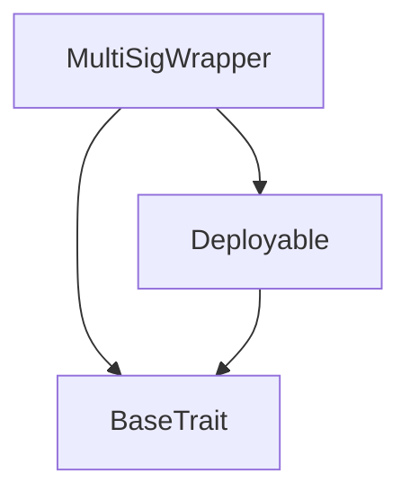
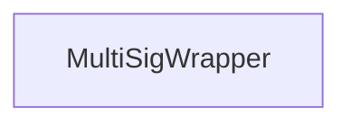

# Tact compilation report
Contract: MultiSigWrapper
BoC Size: 3831 bytes

## Structures (Structs and Messages)
Total structures: 22

### DataSize
TL-B: `_ cells:int257 bits:int257 refs:int257 = DataSize`
Signature: `DataSize{cells:int257,bits:int257,refs:int257}`

### SignedBundle
TL-B: `_ signature:fixed_bytes64 signedData:remainder<slice> = SignedBundle`
Signature: `SignedBundle{signature:fixed_bytes64,signedData:remainder<slice>}`

### StateInit
TL-B: `_ code:^cell data:^cell = StateInit`
Signature: `StateInit{code:^cell,data:^cell}`

### Context
TL-B: `_ bounceable:bool sender:address value:int257 raw:^slice = Context`
Signature: `Context{bounceable:bool,sender:address,value:int257,raw:^slice}`

### SendParameters
TL-B: `_ mode:int257 body:Maybe ^cell code:Maybe ^cell data:Maybe ^cell value:int257 to:address bounce:bool = SendParameters`
Signature: `SendParameters{mode:int257,body:Maybe ^cell,code:Maybe ^cell,data:Maybe ^cell,value:int257,to:address,bounce:bool}`

### MessageParameters
TL-B: `_ mode:int257 body:Maybe ^cell value:int257 to:address bounce:bool = MessageParameters`
Signature: `MessageParameters{mode:int257,body:Maybe ^cell,value:int257,to:address,bounce:bool}`

### DeployParameters
TL-B: `_ mode:int257 body:Maybe ^cell value:int257 bounce:bool init:StateInit{code:^cell,data:^cell} = DeployParameters`
Signature: `DeployParameters{mode:int257,body:Maybe ^cell,value:int257,bounce:bool,init:StateInit{code:^cell,data:^cell}}`

### StdAddress
TL-B: `_ workchain:int8 address:uint256 = StdAddress`
Signature: `StdAddress{workchain:int8,address:uint256}`

### VarAddress
TL-B: `_ workchain:int32 address:^slice = VarAddress`
Signature: `VarAddress{workchain:int32,address:^slice}`

### BasechainAddress
TL-B: `_ hash:Maybe int257 = BasechainAddress`
Signature: `BasechainAddress{hash:Maybe int257}`

### Deploy
TL-B: `deploy#946a98b6 queryId:uint64 = Deploy`
Signature: `Deploy{queryId:uint64}`

### DeployOk
TL-B: `deploy_ok#aff90f57 queryId:uint64 = DeployOk`
Signature: `DeployOk{queryId:uint64}`

### FactoryDeploy
TL-B: `factory_deploy#6d0ff13b queryId:uint64 cashback:address = FactoryDeploy`
Signature: `FactoryDeploy{queryId:uint64,cashback:address}`

### Propose
TL-B: `propose#00000001 queryId:uint64 to:address value:coins payload:Maybe ^cell = Propose`
Signature: `Propose{queryId:uint64,to:address,value:coins,payload:Maybe ^cell}`

### Sign
TL-B: `sign#00000002 queryId:uint64 proposalId:uint64 = Sign`
Signature: `Sign{queryId:uint64,proposalId:uint64}`

### Execute
TL-B: `execute#00000003 queryId:uint64 proposalId:uint64 = Execute`
Signature: `Execute{queryId:uint64,proposalId:uint64}`

### Revoke
TL-B: `revoke#00000004 queryId:uint64 proposalId:uint64 = Revoke`
Signature: `Revoke{queryId:uint64,proposalId:uint64}`

### ProposeAddOwner
TL-B: `propose_add_owner#00000010 queryId:uint64 newOwner:address = ProposeAddOwner`
Signature: `ProposeAddOwner{queryId:uint64,newOwner:address}`

### ProposeRemoveOwner
TL-B: `propose_remove_owner#00000011 queryId:uint64 owner:address = ProposeRemoveOwner`
Signature: `ProposeRemoveOwner{queryId:uint64,owner:address}`

### ProposeUpdateThreshold
TL-B: `propose_update_threshold#00000012 queryId:uint64 newThreshold:uint8 = ProposeUpdateThreshold`
Signature: `ProposeUpdateThreshold{queryId:uint64,newThreshold:uint8}`

### Proposal
TL-B: `_ kind:uint8 to:address value:coins payload:Maybe ^cell proposer:address signBitmap:uint32 signCount:uint8 executed:bool expiry:uint64 = Proposal`
Signature: `Proposal{kind:uint8,to:address,value:coins,payload:Maybe ^cell,proposer:address,signBitmap:uint32,signCount:uint8,executed:bool,expiry:uint64}`

### MultiSigWrapper$Data
TL-B: `_ ownerIndex:dict<address, int> ownerByIndex:dict<int, address> ownerBitmap:uint32 ownerCount:uint8 nextOwnerSlot:uint8 threshold:uint8 proposals:dict<int, ^Proposal{kind:uint8,to:address,value:coins,payload:Maybe ^cell,proposer:address,signBitmap:uint32,signCount:uint8,executed:bool,expiry:uint64}> nextProposalId:uint64 openProposalCount:uint64 locked:bool = MultiSigWrapper`
Signature: `MultiSigWrapper{ownerIndex:dict<address, int>,ownerByIndex:dict<int, address>,ownerBitmap:uint32,ownerCount:uint8,nextOwnerSlot:uint8,threshold:uint8,proposals:dict<int, ^Proposal{kind:uint8,to:address,value:coins,payload:Maybe ^cell,proposer:address,signBitmap:uint32,signCount:uint8,executed:bool,expiry:uint64}>,nextProposalId:uint64,openProposalCount:uint64,locked:bool}`

## Get methods
Total get methods: 9

## ownerCount
No arguments

## threshold
No arguments

## nextProposalId
No arguments

## openProposalCount
No arguments

## contractBalance
No arguments

## isOwner
Argument: addr

## getOwnerIndex
Argument: addr

## getProposal
Argument: id

## ownerBitmap
No arguments

## Exit codes
* 2: Stack underflow
* 3: Stack overflow
* 4: Integer overflow
* 5: Integer out of expected range
* 6: Invalid opcode
* 7: Type check error
* 8: Cell overflow
* 9: Cell underflow
* 10: Dictionary error
* 11: 'Unknown' error
* 12: Fatal error
* 13: Out of gas error
* 14: Virtualization error
* 32: Action list is invalid
* 33: Action list is too long
* 34: Action is invalid or not supported
* 35: Invalid source address in outbound message
* 36: Invalid destination address in outbound message
* 37: Not enough Toncoin
* 38: Not enough extra currencies
* 39: Outbound message does not fit into a cell after rewriting
* 40: Cannot process a message
* 41: Library reference is null
* 42: Library change action error
* 43: Exceeded maximum number of cells in the library or the maximum depth of the Merkle tree
* 50: Account state size exceeded limits
* 128: Null reference exception
* 129: Invalid serialization prefix
* 130: Invalid incoming message
* 131: Constraints error
* 132: Access denied
* 133: Contract stopped
* 134: Invalid argument
* 135: Code of a contract was not found
* 136: Invalid standard address
* 138: Not a basechain address
* 6232: No free owner slots
* 8723: Proposal expired
* 9020: Threshold too low
* 10685: Threshold exceeds owner count
* 14662: Already an owner
* 14837: Cannot remove: would break threshold
* 25317: Too many open proposals
* 26088: Threshold cannot exceed owner count
* 27765: Insufficient valid signatures
* 31938: Value must be non-negative
* 37039: Proposal not found
* 40200: Re-entrancy detected
* 42859: Max owners reached
* 43663: Not signed
* 43758: Cannot remove last owner
* 46052: Threshold must be >= 1
* 46476: Target is not an owner
* 48859: Threshold too high after removal
* 52683: Already executed
* 55591: Insufficient contract balance
* 56837: Not an owner
* 57569: Already signed
* 60664: Insufficient balance for transfer

## Trait inheritance diagram

## Contract dependency diagram

